# Learning ASP.NET Core Minimal API by doing an Image Uploader project
### Requirement
- Create a form with the following input
    - Title of image (required)
    - A file input that accept only "jpeg, png or gif". (required)
- Input Validation
- When submission is successful, redirect it to a page with unique id
    - This page will show the title of the image and the image itself
    - The url should be in the form of "/picture/{xxxx}" where xxxx is uploaded image id
- We are not using any databases, store the information about the uploaded images/title in a JSON format stored in disk.

# Create a form with the required input

To get started, let's create a new project using the following command:

```bash
dotnet new web -n ImageUploader
```

This command will create a new Minimal API project named MyMinimalApi.

Now, let's update the code in the Program.cs file to include a form with required input, instead of returning "Hello World" message. Replace the existing code with the following:

```csharp
var builder = WebApplication.CreateBuilder(args);
var app = builder.Build();

app.MapGet("/", () =>
{
    var html = @"
        <html>
        <body>
            <h1>Image Uploader</h1>
            <form method='POST' action='/submit' enctype='multipart/form-data'>
                <label for='imageTitle'>Title of Image:</label>
                <input type='text' id='imageTitle' name='imageTitle' required><br><br>

                <label for='imageFile'>Image File (JPEG, PNG, GIF):</label>
                <input type='file' id='imageFile' name='imageFile' accept='.jpeg, .jpg, .png, .gif' required><br><br>

                <input type='submit' value='Submit'>
            </form>
        </body>
        </html>
    ";

    return Results.Content(html, "text/html");
});

app.MapPost("/submit", (HttpContext context) =>
{
    // Access form data
    var form = context.Request.Form;
    var title = form["imageTitle"];
    var imageFile = form.Files.GetFile("imageFile");

    var responseHtml = $@"
        <html>
        <body>
            <h1>Image Uploaded</h1>
            <p>Title: {title}</p>
        </body>
        </html>
    ";

    return Results.Content(responseHtml, "text/html");
});

app.Run();
```
### In the updated code, we have defined two routes:

- The "/" route handles the GET request and returns an HTML form with fields for title and image.
- The "/submit" route handles the POST request when the form is submitted. It retrieves the form data and generates a response HTML showing the submitted data.
- Now, when you run the project using dotnet run, you should see the initial form when you navigate to http://localhost:5xxx in your browser.


I suggest using for this command to automatically restart whenever changes are detected in the source code.
```bash
dotnet watch
```

### Here is how it will look: 
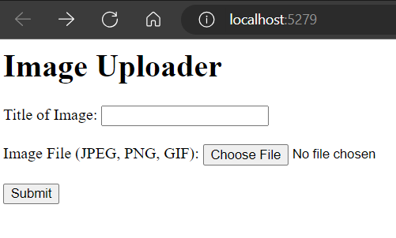

### After the submission:
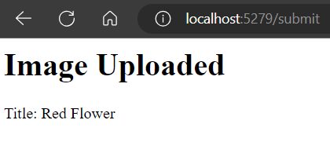


When you sumbit the form you are redirected to the route mentionned in :
```html 
<form method='POST' action='/submit' enctype='multipart/form-data'>
```
<p><b>***Note***:</b> This is not what we want to do, we shouldn't take an action, unless we are sure that the image format is valid.</p>
<p>You may wonder, we added this checks in the html, why do we need another check?!</p>
<p>You are right! While we have incorporated checks in the HTML form to validate the image format on the client side,  it's crucial to emphasize that client-side validation alone is not sufficient. We must implement server-side checks as well</p>

## Let me demonstrate why:
<p>In the client-side, it's only limiting the available formats for image selection, it's essential to recognize that these checks can be bypassed or modified</p>

### you can simply change this to accept all file
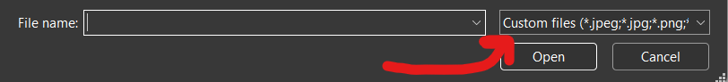

### I can upload a PDF now:
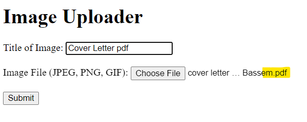

We will apply some modification in the code:
- Remove the action from the form post request
- Separate the HTML in an index.html
- Add some css, make a logo for our project

## Updated file
```csharp
var builder = WebApplication.CreateBuilder(args);
var app = builder.Build();

app.MapGet("/", () =>
{
    string html = File.ReadAllText("index.html");
    return Results.Content(html, "text/html");
});

app.MapPost("/", () =>
{
    // Todo: 
    // 1. Make input validation,
    // if valid:
    // 2. Store the image to upload it after redirection
    // 3. redirect it to a page with unique id with this url format "/picture/{xxxx}" 
    // where xxxx is uploaded image id
});
app.Run();
```
### To follow up:
Go copy [index.html](./index.html) and [style.css](./wwwroot/style.css), add them in the same directory of program.cs.

### Run your new file:
The interface remains unstyled, without any updated logo :(
<br>
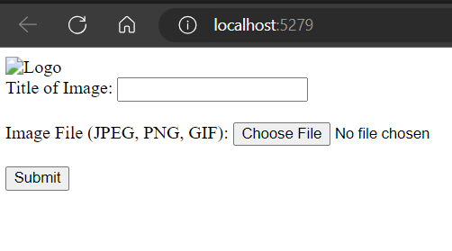

### Let's inspect to the console
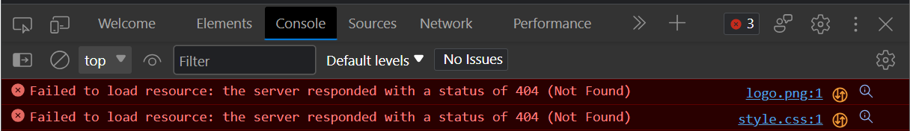

You should now be able to see this error, the server is not able to locate the resources although they are here, in our project directory.

By default, static files (These files include HTML files, CSS stylesheets, JavaScript files, images, fonts, and other static assets) are served only from the web root directory and its sub-directories.

Create a directory called wwwroot, by default this item content is added to .csproj. If it's not configured by default, add it by yourself.
```bash
<ItemGroup>
  <Content Include="wwwroot\**" CopyToOutputDirectory="PreserveNewest" />
</ItemGroup>
```
Move your assets directory containing your logos and style.css to wwwroot.

# UseStaticFiles():
By calling this method in Program.cs, static files are enabled to be served.

```csharp
var builder = WebApplication.CreateBuilder(args);
var app = builder.Build();

app.UseStaticFiles();

app.MapGet("/", () =>
{
    string html = File.ReadAllText("./index.html");
    return Results.Content(html, "text/html");
});

app.MapPost("/", () =>
{
    // Todo: 
    // 1. Make input validation,
    // if valid:
    // 2. Store the image to upload it after redirection
    // 3. redirect it to a page with unique id with this url format "/picture/{xxxx}" 
    // where xxxx is uploaded image id
});

app.Run();
```
#### Most of the time you will need to stop dotnet watch a rerun again after using ***app.UseStaticFiles();***

## Problem 1 is sovled xD:

Serving Static files from wwwroot directory.


# Async Programming
Using asynchronous file operations is generally recommended to improve the responsiveness of our application, especially when dealing with potentially long-running I/O operations.
- It allows your program to continue executing other tasks while waiting for the asynchronous operation to complete.

We can use the **ReadAllTextAsync** method instead of **ReadAllText**. Here's an updated version of your code using asynchronous file reading:
```csharp
var builder = WebApplication.CreateBuilder(args);
var app = builder.Build();

app.UseStaticFiles();

app.MapGet("/", async () =>
{
    string html = await File.ReadAllTextAsync("./index.html");
    return Results.Content(html, "text/html");
});
```
# HttpContext
The HttpContext object represents the context of an HTTP request and provides access to various properties and methods related to the current request and response. It allows you to access information about the incoming HTTP request, such as headers, query parameters, cookies, and **form data** <small>(what we care about)</small>.

Before diving into form data handling, let's explore the **HttpContext.Response**  object. While it shares functionalities with the **Results class**, there is a notable distinction that sets them apart.

## HttpContext.Response
we can write this function:
```csharp
app.MapGet("/", async () =>
{
    string html = await File.ReadAllTextAsync("./index.html");
    return Results.Content(html, "text/html");
});
```
as:
```csharp
app.MapGet("/", async context =>
{
    string html = await File.ReadAllTextAsync("./index.html");
    await context.Response.WriteAsync(html);
});
```
- ***The context.Response.WriteAsync(formContent)*** method is used to asynchronously write the provided content directly to the response body stream. It allows you to manually write the response content in a custom format or structure.

- On the other hand, ***Results.Content(html, "text/html")*** is a helper method that generates an IResult object representing the response content. The IResult interface defines a contract for generating an HTTP response. In this case, Results.Content creates an IResult that will return the specified html content with a MIME type of "text/html". The IResult object can be returned from the handler to indicate the desired response content and type.

The main difference between using ***context.Response.WriteAsync*** and ***Results.Content*** is the level of **abstraction**

## HttpContext.Request

To get a deeper understanding on ***HttpsContext.Request***, we will with some code and debug.

Let's add a break point in this post request and check our variables by running the debugger.
- The debugger should stop after submitting the form

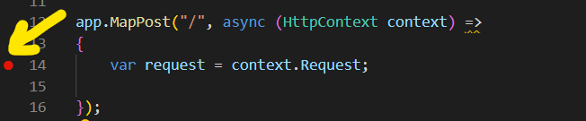

This is how the context variable looks like:
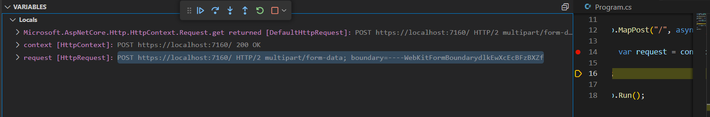
As we said, we are focused on ***Request*** and ***Response***
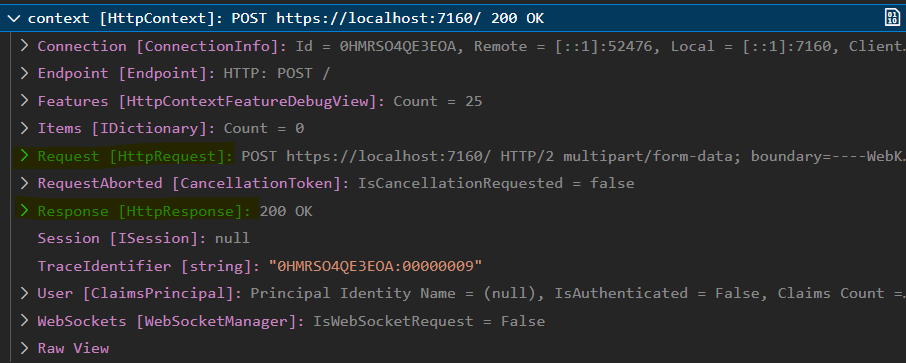

Notice that the Form is null in the response object although I fill it :( <br>

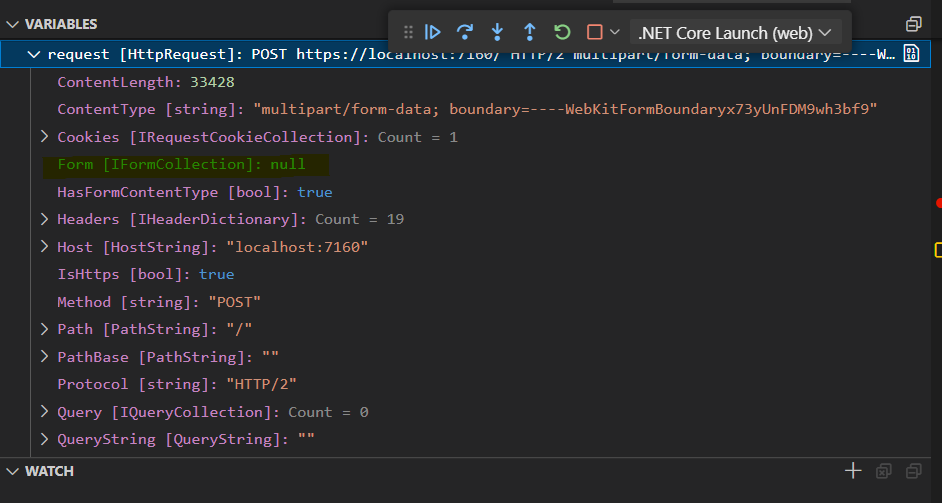  

- And here is why we should use any async function with precautions, we should add ***await*** for not continue to the next line before actually reading all the data from the form.
```csharp
app.MapPost("/", async (HttpContext context) =>
{
    var request = await context.Request.ReadFormAsync();

});
```
Form is no longer null, and data is passed to the request correctly.<br>

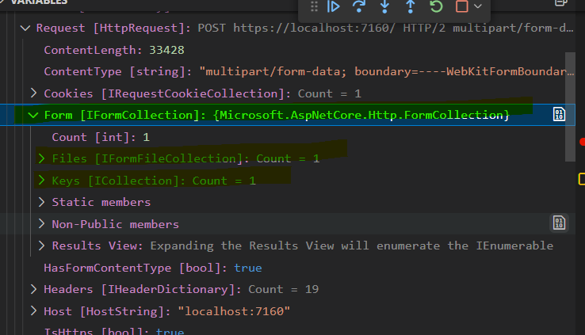 

<small>The highlighted data is important, we will use them later</small>

***Note that*** the ***HttpContext object*** is available only in the scope of the request being processed. Each request will have its own unique HttpContext instance, allowing you to handle multiple concurrent requests independently.

# Data Validation
```csharp
app.MapPost("/", async (HttpContext context) =>
{
    var form = await context.Request.ReadFormAsync();
    var title = form["imageTitle"];
    var imgFile = form.Files.GetFile("imageFile");
    
    // Check for title
    if (form.Keys.Count == 0 || string.IsNullOrEmpty(title))
    {
        return Results.BadRequest(new { error = "Empty title string"});
    }
    
    // Check for file
    if (form.Files.Count == 0 || imgFile is null)
    {
        return Results.BadRequest(new { error = "No file uploaded"});
    }

    // Check for extension
    string imgName = Path.GetFileName(imgFile.FileName);
    string extension = Path.GetExtension(imgName).ToLower();
    if (extension != ".png" && extension != ".jpg" && extension != ".jpeg" && extension != ".gif")
    {
        return Results.BadRequest(new { error = "Invalid uploaded format"});
    }

    return Results.Ok();
});
```
## Testing bad requests on postman
 
 

# Storing image in disk
Images are stored with new name(a generated ID).<br>
Store all images in a new directory called uploads.<br>
```csharp
string imageID =  Guid.NewGuid().ToString();
string targetDirectory = Path.Combine(Directory.GetCurrentDirectory(), "uploads");
string targetFilePath = Path.Combine(targetDirectory, imageID + extension);

if (!Directory.Exists(targetDirectory))
{
    Directory.CreateDirectory(targetDirectory);
}

using (var stream = new FileStream(targetFilePath, FileMode.Create))
{
    await imgFile.CopyToAsync(stream);
}
```
</small>The using statement ensures that the file stream is properly closed and disposed of after the image file is copied to the target location.</small>

# Store the information in a JSON format stored in disk.

- include this -> ```using System.Text.Json;```
```csharp
string jsonFile = Path.Combine(Directory.GetCurrentDirectory(), "data.json");
// Create a new ImageDetails class for easy Serialization and Deseralization
var imageDetails = new ImageDetails
{
    ID = imageID,
    Title = title.ToString(),
    Path = targetFilePath
};

var options = new JsonSerializerOptions
{
    WriteIndented = true
};
```
ImageDetails class
```csharp
public class ImageDetails
{
    public string? ID { get; set; }
    public string? Title { get; set; }
    public string? Path { get; set; }
}
```

### Let's make our ***data.json*** appendable
You can't make this by keeping appending to the file by every JSON object, as it won't keep the format of JSON list, which will cause an exception during deserialization.

## The file will be in this format
```
{
    ID = "63471deb-b0f5-4d77-b58c-a0590c7af8cb",
    Title = "Image 1",
    Path = "/path/to/63471deb-b0f5-4d77-b58c-a0590c7af8cb.jpg"
}
{
    ID = "64f8bd4e-f004-4ab3-99b8-8a2e055225cf",
    Title = "Image 2",
    Path = "/path/to/64f8bd4e-f004-4ab3-99b8-8a2e055225cf.jpg"
}
```
## Instead of
```
[
    {
        ID = "63471deb-b0f5-4d77-b58c-a0590c7af8cb",
        Title = "Image 1",
        Path = "/path/to/63471deb-b0f5-4d77-b58c-a0590c7af8cb.jpg"
    }
    {
        ID = "64f8bd4e-f004-4ab3-99b8-8a2e055225cf",
        Title = "Image 2",
        Path = "/path/to/64f8bd4e-f004-4ab3-99b8-8a2e055225cf.jpg"
    }
]
```
So we will need to get all the data from the file, append to them the new object, then write all back at once.
```csharp
    string jsonFile = Path.Combine(Directory.GetCurrentDirectory(), "data.json");
    var imageDetails = new ImageDetails
    {
        ID = imageID,
        Title = title.ToString(),
        Path = targetFilePath
    };

    var options = new JsonSerializerOptions
    {
        WriteIndented = true
    };

    var imageList = new List<ImageDetails>();;
    bool fileExists = File.Exists(jsonFile);
    if (fileExists)
    {
        string json = await File.ReadAllTextAsync(jsonFile);
        imageList = JsonSerializer.Deserialize<List<ImageDetails>>(json);
    }

    imageList.Add(imageDetails);
    string updatedJson = JsonSerializer.Serialize(imageList, options);

    await File.WriteAllTextAsync(jsonFile, updatedJson);
```
# Redirect to page in the form of "/picture/{xxxx}" 

Return an ***HTTP redirect response*** with the imageID  
```csharp
return Results.Redirect($"/picture/{imageID}");
```
<small>Let's move to last step(last problem xD)</small>

# Display the form content
One last problem is showing the uploaded image in the new page<br>
Let's write our startup code

```csharp
app.MapGet("/picture/{id}", async (string id) =>
{
    string jsonFile = Path.Combine(Directory.GetCurrentDirectory(), "data.json");
    string json = await File.ReadAllTextAsync(jsonFile);
    List<ImageDetails>? imageList = JsonSerializer.Deserialize<List<ImageDetails>>(json);
    var image = imageList.FirstOrDefault(i => i.ID == id);

    if (image != null)
    {
        var html = $@"
            <html>
            <head></head>
            <body>
                <h2>Title: {image.Title}</h2>
                
                <br/><br/>
                <button class=""goback-btn"" onclick=""window.location.href='/';"">Go Back</button>
            </body>
            </html>
            ";
        return Results.Content(html, "text/html");
    }
    else
    {
        return Results.StatusCode(404);
    }
});
```
The very first approach that you may think of, is deserialize **data.json**, LINQ the ImageDetails having the same id as follow:
```csharp
var image = imageList.FirstOrDefault(i => i.ID == id);
```
## Let's watch our app and see what will happen:
### Image is not loaded
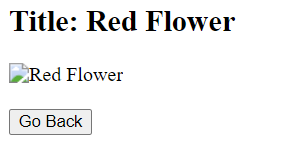
### 


We have previously mentioned a similar problem when we were trying to upload our logo and the style.css and we said that by default ASP.NET only serve static files located in wwwroot, not in a local resource.
<br>
## Let's do that by adding this function after ***app.UseStaticFiles();***
```csharp
app.UseStaticFiles(new StaticFileOptions
{
    FileProvider = new PhysicalFileProvider(
        Path.Combine(Directory.GetCurrentDirectory(), "uploads")),
    RequestPath = "/uploads"
});
```
- include this -> ```using Microsoft.Extensions.FileProviders;```

Using this configuration, you can serve files from the uploads directory in your ASP.NET Core application using the /uploads URL prefix.

- Don't forget to change the path being stored in data.JSON to:
```
Path = $"/uploads/{imageID}{extension}"
```
<small>Not the actual path of the uploaded file</small>

### Finally we will add some styling to our form:
And here is the final function
```csharp
app.MapGet("/picture/{id}", async (string id) =>
{
    string jsonFile = Path.Combine(Directory.GetCurrentDirectory(), "data.json");
    string json = await File.ReadAllTextAsync(jsonFile);
    List<ImageDetails>? imageList = JsonSerializer.Deserialize<List<ImageDetails>>(json);
    var image = imageList.FirstOrDefault(i => i.ID == id);

    if (image != null)
    {
        var html = $@"
            <html>
            <head>
                <style>
                    body {{
                        font-family: Arial, sans-serif;
                        background-color: #f2f2f2;
                        display: flex;
                        justify-content: center;
                        align-items: center;
                        height: 100vh;
                        margin: 0;
                        padding: 20px;
                    }}

                    .content {{
                        text-align: center;
                    }}

                    h2 {{
                        color: #333;
                        margin-bottom: 20px;
                    }}

                    img {{
                        max-width: 500px;
                        height: auto;
                        margin-bottom: 20px;
                    }}

                    .goback-btn {{
                        padding: 10px 20px;
                        background-color: #333;
                        color: #fff;
                        text-decoration: none;
                        border: none;
                        border-radius: 4px;
                        cursor: pointer;
                    }}

                    .goback-btn:hover {{
                        background-color: #555;
                    }}
                </style>
            </head>
            <body>
                <div class=""content"">
                    <h2>Title: {image.Title}</h2>
                    
                    <br/><br/>
                    <button class=""goback-btn"" onclick=""window.location.href='/';"">Go Back</button>
                </div>
            </body>
            </html>
            ";
        return Results.Content(html, "text/html");
    }
    else
    {
        return Results.StatusCode(404);
    }
});
```
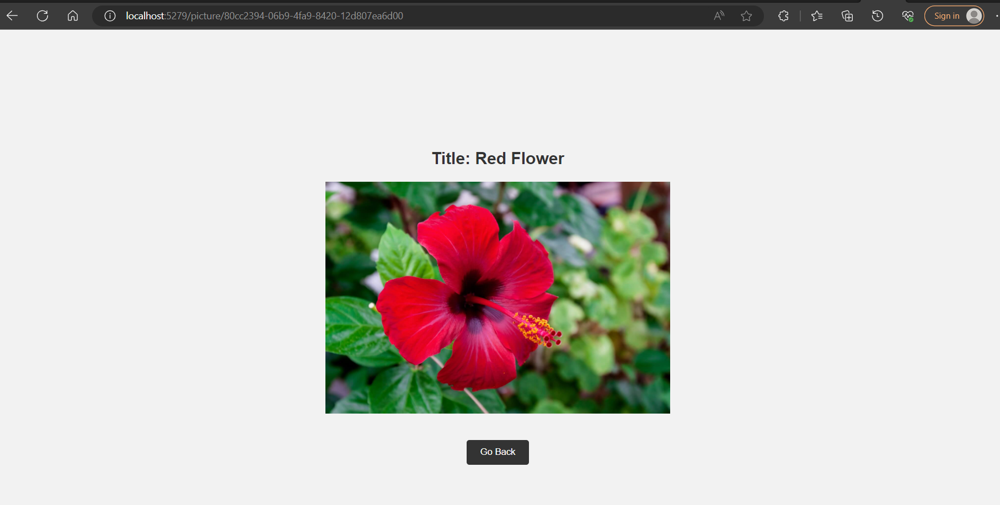

## Todo: Separate your html from: 
```app.MapGet("/picture/{id}", async (string id) => {}``` <br>
Think if how you can pass {image.Path} and {image.Title} to that file.